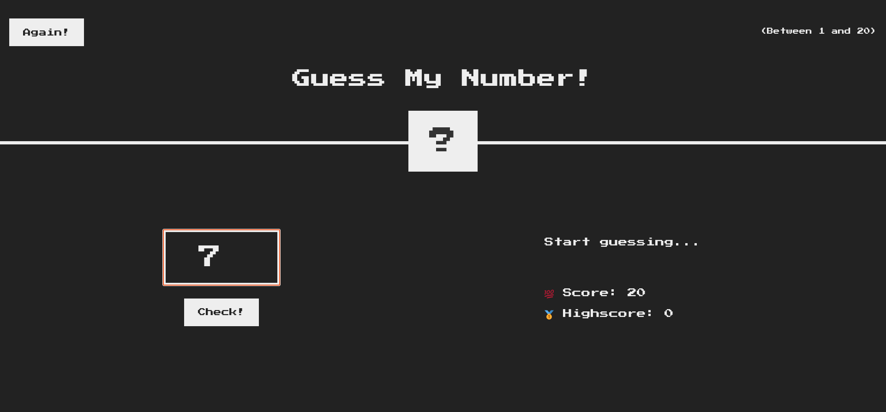
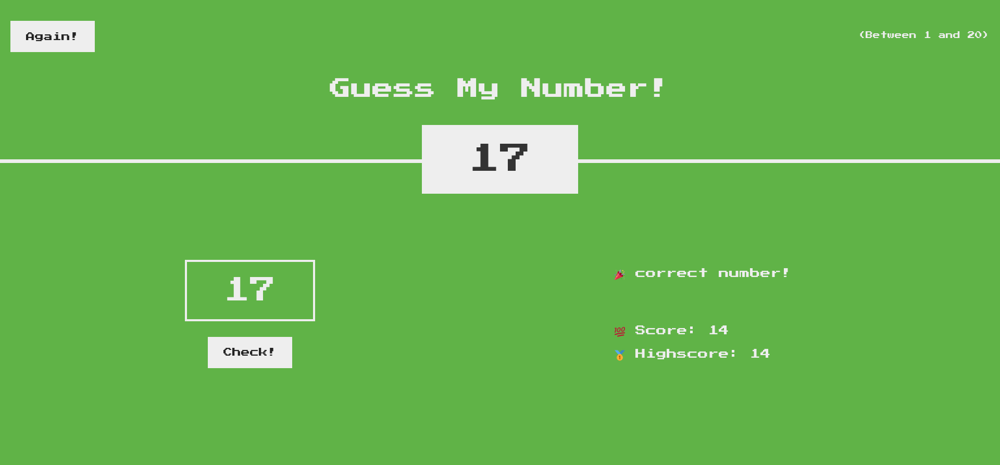

# JavaScript Number Guessing Game Project

## Hosted Project

JavaScript Number Guessing Game Project (Hosted on my Github Pages):

## Project Objective

This JavaScript number guessing game project's objective is to code a game where the user must guess a randomly generated number from 1 to 20.

## JavaScript Used

- Math.random()
- DOM manipulations
- functions
- conditionals
- loops

## Screenshots

